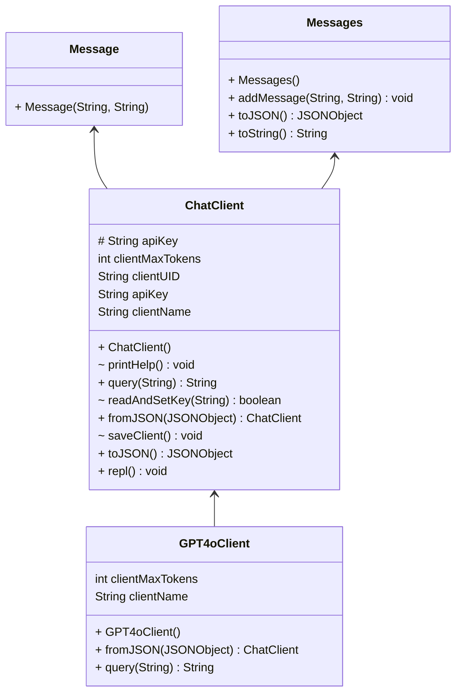

# PA1 - LLM ChatManager

Recently the LLM (Large Language Model) has become amazingly powerful and popular in the world. Several companies have deployed their LLM chat services, such as ChatGPT from OpenAI. In this programming assignment, you are going to implement a simple local chat manager (the `ChatManager` class) that can interact with different LLM chat clients (the `ChatClient` class) and persist chat sessions.

## Grading

In PA1, you need to implement two tasks, detailed implementation can be searched with "TODO" in the codebase.

- Task 1: Implement some methods in `ChatManager` class and `ChatClient` class, implement the all things in the `GPT4oChatClient` class.
- Task 2: Implement the persistence functionalities in the `ChatManager` class

We will provide public test cases for you to verify the correctness of your implementations. However, passing all the public test cases does not mean that you can obtain the full mark for the PA. We also have many additional test cases as the hidden ones, which are different from the ones we provided in the skeleton.

| Item                                             | Ratio | Notes                                                                              |
|--------------------------------------------------|-------|------------------------------------------------------------------------------------|
| Having at least three commits on different days  | 5%    | You should commit three times during different days in your repository             |
| Code style                                       | 5%    | You get 5% by default, and every 5 warnings from CheckStyle deducts 1%.            |
| Task 1 Public test cases                         | 15%   | Based on the Result of GitHub Classroom (# of passing tests / # of provided tests) |
| Task 1 Private test cases                        | 15%   | Based on TA evaluation (# of passing tests / # of provided tests)                  |
| Task 1 Bonus                                     | 5%    | Based on TA evaluation                                                             |
| Task 2 Public test cases                         | 30%   | Based on the Result of GitHub Classroom (# of passing tests / # of provided tests) |
| Task 2 Private test cases                        | 30%   | Based on TA evaluation (# of passing tests / # of provided tests)                  |
| Task 2 Bonus                                     | 5%    | Based on TA evaluation                                                             |


## Local Test

It's recommended to run and test with IntelliJ IDEA and OpenJDK 17. The project is written as a command line Read-Eval-Print loop, you can run the application with the following command (or IDE-integrated application runner) to play with it:

```bash
# play with the repl
./gradlew run
```

Here's a screencast of the application running:

[](https://asciinema.org/a/kBYt3kYUAW5j0Z18hfzBvn0EM)

We use JUnit5 test to validate the correctness of individual methods that you need to implement, the specific test commands and their corresponding task is given below:

```bash
# run all public tests
./gradlew test
```

### Task1

```bash
# run Task1 public tests
./gradlew test --tests "hk.ust.cse.comp3021.Task1Test"
```

| Test Name                   | Score | Related Methods                                              |
|-----------------------------|-------|--------------------------------------------------------------|
| showChatClients             | 3%    | `ChatManager.showChatClients`                                |
| getChatClient               | 3%    | `ChatManager.getChatClient` and `InvalidClientNameException` |
| replChatClient              | 3%    | `GPT4oClient`                                                |
| replChatClientConversation1 | 3%    | `GPT4oClient`                                                |
| replChatClientConversation2 | 3%    | `GPT4oClient`                                                |
| Private Test Cases          | 15%   | The file upload feature in `ChatClient.repl`                 |

### Task2 (Not released)

```bash
./gradlew test --tests "hk.ust.cse.comp3021.Task2Test"
```

## Project Structure

:warning: Please check regularly for any updates from the skeleton repo. :warning:

The project structure is as follows:

- `ChatManager` manages all `ChatClient`s, `repl()` is the entry point for the command-line REPL (outer REPL).
- `ChatClient` contains common implementation and specifies abstract methods, `repl()` is the entry point for the chat REPL (inner REPL).
  - `Message` and `Messages` are used for storing chat messages.
- `GPT4oClient` is a concrete class that extends `ChatClient`, `query()` is used for interacting with the API service.
- `Utils` contains some utility functions.



## Submission Policy

PA submission is similar to lab submission, both use GitHub Classroom as demonstrated in [lab1](https://hkustconnect-my.sharepoint.com/:p:/g/personal/xchenht_connect_ust_hk/EXr8FR9l1ytKh4LFdQceHDYB9gO-hAc4f-GAYyb0jp7LBA?e=KdDj78). Please modify and commit to your own repo. Each commit will trigger a Github Action for autograding, and you can check the your public score in latest GitHub Action. 

:heavy_exclamation_mark: Do not share your code with others. :heavy_exclamation_mark:

## Academic Integrity

We trust that you are familiar with the Honor Code of HKUST. If not, refer to [this page](https://course.cse.ust.hk/comp3021/#policy).

## Contact

If you have any questions, please email TA Xiang Chen via xchenht@connect.ust.hk
