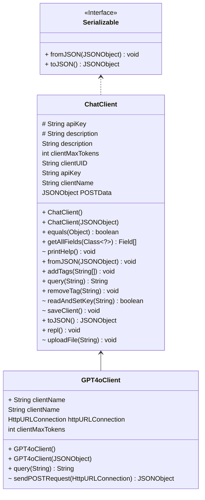

# PA3 - LLM ChatManager

In PA2 we implemented the `generateProfile` method using functional programming. One of the advantages of functional
programming is that it is easier to be parallelized, which can boost the profiling process. In this PA, you will
implement three versions of `generateProfile`: base (serial), parallel, and thread pool. The testcases will evaluate
your implementation regarding the performance and correctness of the profiling process.

## Demo

It's recommended to run and test with IntelliJ IDEA and OpenJDK 17. The project is written as a command line
Read-Eval-Print loop, you can run the application with the following command (or IDE-integrated application runner) to
play with it:

```bash
# play with the repl
./gradlew run
```

Here's a screencast of the application running:

[](https://asciinema.org/a/2YH05TlQpY0aC5WUJF8plwIOY)

## Change Log

- PA0: Initial release, implement the basic functionalities of `ChatManager` and `ChatClient` and `GPT4oClient` class,
  design Task1 test cases
- PA1:
    - `ChatManager`: refine REPL, add history and list command
    - `ChatClient`: add persistence functionalities, add tag and description, add token statistics in Message
    - Add Interface `Serializable` for `ChatClient` and `Message`
    - Add annotations for guiding persistence
    - Add Task2 test cases
    - Code refactoring and bug fixing
- PA2:
    - Merge sessions into one database file, which manages all users and their sessions
    - Add `SessionManager` as the interface between ChatClient and session files.
    - Add PA2 test cases
    - Code refactoring and bug fixing
- PA3:
    - Add three mode of profiling and a common interface `generateProfile`
    - Add PA3 test cases

## Grading

In PA3, you need to implement the three main profiling methods along with their utility methods, detailed implementation
can be searched with "TODO" in the codebase.

- `generateProfileBase`: generate the profile for a user using functional programming.
    - We will use the collect operation to iterate through the sessions and accumulate the statistics. We have already
      defined the `profileCollector`, which implements the
      [Collector](https://docs.oracle.com/javase/8/docs/api/java/util/stream/Collector.html) interface
- `generateProfileParallel`: generate the profile for a user using parallel programming (collect)
- `generateProfileThreadPool`: generate the profile for a user using thread pool programming

The above three methods rely on some common utility methods:

- `accumulateSessionToProfile`:
  the [accumulator](https://docs.oracle.com/javase/8/docs/api/java/util/stream/Collector.html#accumulator--)
  accumulate the sessions to the profile
- `combineTwoProfiles`:
  the [combiner](https://docs.oracle.com/javase/8/docs/api/java/util/stream/Collector.html#combiner--)
  combine two profiles, only used in parallel and threadpool mode
- `postProcess`: the [finisher](https://docs.oracle.com/javase/8/docs/api/java/util/stream/Collector.html#finisher--)
  perform avg and topString operations and delete useless fields in the profile

PS: all methods above, except for `generateProfileThreadPool`, could be implemented using one `return` statement!

We will provide public test cases for you to verify the correctness of your implementations. However, passing all the
public test cases does not mean that you can obtain the full mark for the PA. We also have many additional test cases as
the hidden ones, which are different from the ones we provided in the skeleton.

| Item                                            | Ratio | Notes                                                                           |
|-------------------------------------------------|-------|---------------------------------------------------------------------------------|
| Having at least three commits on different days | 5%    | You should commit three times during different days in your repository          |
| Code style                                      | 5%    | You get 5% by default, and every 5 warnings from CheckStyle deducts 1%.         |
| Public test cases                               | 60%   | Based on the Result of GitHub Action (# of passing tests / # of provided tests) |
| Performance gain                                | 30%   | Based on the boosting scale of your thread pool version                         |
| Bonus                                           | 10%   | Based on TA evaluation                                                          |

## Test

### Preparation

#### Download sessions database

Unzip the database (~128MB) using the following command:

```bash
zstd -d db.json.zst
```

#### Generate an API Key (optional)

:grey_exclamation: In this PA, you don't need to upload your api-key to GitHub to pass the testcases as required in
PA1. :grey_exclamation:

To run the application locally, you need to get an API key from
the [HKUST GenAI platform](https://itso.hkust.edu.hk/services/it-infrastructure/azure-openai-api-service) and replace
all the `apiKey` field in our provided session database into your encrypted api-key.

### Code style

To check the code style, run the following commands and make sure no warnings emitted.

```bash
./gradlew checkstyleMain
```

### Public test

We rely on PA2 test cases to test the correctness of your implementation for each mode. To run PA2 public tests:

```bash
PROFILE_MODE=base ./gradlew test --tests "hk.ust.cse.comp3021.PA2Test.test*"
PROFILE_MODE=parallel ./gradlew test --tests "hk.ust.cse.comp3021.PA2Test.test*"
PROFILE_MODE=threadpool ./gradlew test --tests "hk.ust.cse.comp3021.PA2Test.test*"
# add --rerun-tasks to force rerun the tests
```

Then we test the profile time of each mode in PA3 test cases. To run PA3 public tests:

```bash
./gradlew test --tests "hk.ust.cse.comp3021.PA3Test"
```

The public test cases and their corresponding statistics are given below:

| Test Name                 | Score | Related Methods/Statistics                                                                     |
|---------------------------|-------|------------------------------------------------------------------------------------------------|
| PA2Test (base mode)       | 10%   | `generateProfileBase`, `accumulateSessionToProfile`, `combineTwoProfiles`, `postProcess`       |
| PA2Test (parallel mode)   | 10%   | `generateProfileParallel`, `accumulateSessionToProfile`, `combineTwoProfiles`, `postProcess`   |
| PA2Test (threadpool mode) | 10%   | `generateProfileThreadPool`, `accumulateSessionToProfile`, `combineTwoProfiles`, `postProcess` |
| testParallelProfileTime   | 15%   | `generateProfileParallel`, `accumulateSessionToProfile`, `combineTwoProfiles`, `postProcess`   |
| testThreadPoolProfileTime | 15%   | `generateProfileThreadPool`, `accumulateSessionToProfile`, `combineTwoProfiles`, `postProcess` |

:warning: Since GitHub Actions has a [2-core CPU limit](https://docs.github.com/en/actions/using-github-hosted-runners/using-github-hosted-runners/about-github-hosted-runners#standard-github-hosted-runners-for--private-repositories)
for private repo, the result of `testParallelProfileTime` does not count, please submit the screenshot on your local machine :warning:

### Performance gain

We want the threadpool mode profiling can achieve a comparable, even better performance than the parallel mode. Let's
denote the ratio of parallelProfileTime and threadPoolProfileTime as s, the performance gain score is computed as:

- s < 0.8: score = 0
- s >= 0.8: score = 30 * (s - 0.8) / (max(s) - 0.8)

If you can pass the `testThreadPoolProfileTime`, which correspond to the baseline value of s (0.8), you can start
receiving the performance gain score. The max performance gain will get full score (30) for this part.

For your reference, here's the result on the TA's machine (M2 Macbook Air, 8-core CPU, 8GB RAM) for the three modes:

| Profile Mode | Duration (ms) | Scale |
|--------------|---------------|-------|
| base         | 12443         | 1     |
| parallel     | 3001          | 4.15  |
| threadpool   | 2736          | 4.55  |

### Bonus

Implement
the [CONCURRENT](https://docs.oracle.com/javase/8/docs/api/java/util/stream/Collector.Characteristics.html#CONCURRENT)
characteristics for `generateProfileParallel`. You need to convert the `accumulateSessionToProfile` method to a
thread-safe version since the `CONCURRENT` character will process the accumulator using multi-threads.

## Project Structure

:warning: Please check regularly for any updates from the skeleton repo. :warning:

:warning: Do not modify the project structure! :warning:

The project structure is as follows:

- `ChatManager` manages all `ChatClient`s, `repl()` is the entry point for the command-line REPL (outer REPL).
- `ChatClient` contains common implementation and specifies abstract methods, `repl()` is the entry point for the chat
  REPL (inner REPL).
    - Under `client/`, we have two concrete classes `GPT4oClient` and `GPT4ominiClient` that extends `ChatClient`, the
      `query()` method is used for interacting with the API service.
- `SessionManager` provide read/write/profile interface for the session database
- `Message` and `Messages` are used for storing chat messages.
- `Utils` contains some utility functions.
- `Serializable` is an interface for serialization and deserialization, implemented by `ChatClient` and `Message(s)`.
- `annotations/` contains annotations for guiding persistence.
- `exceptions/` contains exceptions corresponding to the annotations, four of them are inherited from
  `PersistenceException`.



## Submission Policy

PA3 submission is similar to PA1 submission, using GitHub Classroom as demonstrated
in [lab1](https://hkustconnect-my.sharepoint.com/:p:/g/personal/xchenht_connect_ust_hk/EXr8FR9l1ytKh4LFdQceHDYB9gO-hAc4f-GAYyb0jp7LBA?e=KdDj78).
Please modify and commit to your own repo. Each commit will trigger a Github Action for autograding, and you can check
the your public score in latest GitHub Action.

:heavy_exclamation_mark: Do not share your code with others. :heavy_exclamation_mark:

## Academic Integrity

We trust that you are familiar with the Honor Code of HKUST. If not, refer
to [this page](https://course.cse.ust.hk/comp3021/#policy).

### Credit

- The project use [org.json](http://stleary.github.io/JSON-java/index.html) as the low-level JSON library for
  serialization and deserialization.
- Some annotations design is inspired by [Jackson](https://github.com/FasterXML/jackson-annotations)
- The session database is adapted from [lmsys-chat-1m](https://huggingface.co/datasets/lmsys/lmsys-chat-1m), we choose
  20k sessions and convert to our sessions JSON format using the [script](./gen-dataset.py)

## Contact

If you have any questions, please email TA Xiang Chen via xchenht@connect.ust.hk
