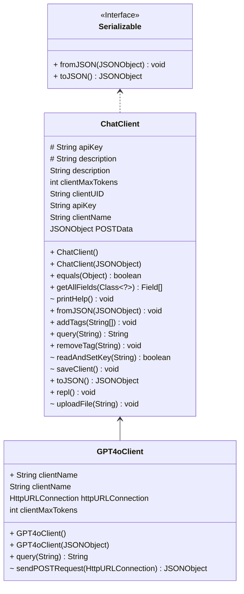

# PA2 - LLM ChatManager

We have already practiced how to build a configurable persistence framework in the LLM ChatManager in PA1. Since we have
got the database containing thousands of serialized sessions, we can perform statistical analysis and generate profile
from them. In this PA, you will need to implement the profile functionalities in the `SessionManager` class.

## Demo

It's recommended to run and test with IntelliJ IDEA and OpenJDK 17. The project is written as a command line
Read-Eval-Print loop, you can run the application with the following command (or IDE-integrated application runner) to
play with it:

```bash
# play with the repl
./gradlew run
```

Here's a screencast of the application running:

[](https://asciinema.org/a/2YH05TlQpY0aC5WUJF8plwIOY)

## Change Log

- PA0: Initial release, implement the basic functionalities of `ChatManager` and `ChatClient` and `GPT4oClient` class,
  design Task1 test cases
- PA1:
  - `ChatManager`: refine REPL, add history and list command
  - `ChatClient`: add persistence functionalities, add tag and description, add token statistics in Message
  - Add Interface `Serializable` for `ChatClient` and `Message`
  - Add annotations for guiding persistence
  - Add Task2 test cases
  - Code refactoring and bug fixing
- PA2:
  - Merge sessions into one database file, which manages all users and their sessions
  - Add `SessionManager` as the interface between ChatClient and session files.
  - Add PA2 test cases
  - Code refactoring and bug fixing

## Grading

In PA2, you need to implement the following methods, detailed implementation can be searched with "TODO" in the
codebase.

- You will be implementing the profile functionality in the `SessionManager` class, which is responsible for
  generating the profile from the session database. The profile consists of 25 statistics from 6 types.
- The focus of PA2 is functional programming, you need to convert the Sessions into Streams and perform the statistical analysis on them.
- You are free to use provided utility methods in the `Utils` class, or implement your own helper methods.

We will provide public test cases for you to verify the correctness of your implementations. However, passing all the
public test cases does not mean that you can obtain the full mark for the PA. We also have many additional test cases as
the hidden ones, which are different from the ones we provided in the skeleton.

| Item                                            | Ratio | Notes                                                                           |
|-------------------------------------------------|-------|---------------------------------------------------------------------------------|
| Having at least three commits on different days | 5%    | You should commit three times during different days in your repository          |
| Code style                                      | 5%    | You get 5% by default, and every 5 warnings from CheckStyle deducts 1%.         |
| Public test cases                               | 60%   | Based on the Result of GitHub Action (# of passing tests / # of provided tests) |
| Private test cases                              | 30%   | Based on TA evaluation (# of passing tests / # of provided tests)               |
| Bonus                                           | 10%   | Based on TA evaluation                                                          |

## Test

### Preparation

#### Download sessions database

Download the sessions database (~111MB) is tracked using Git LFS, use the following command to download the database:

```shell
git lfs install
git lfs pull
```

#### Generate an API Key (optional)

:grey_exclamation: In this PA, you don't need to upload your api-key to GitHub to pass the testcases as required in
PA1. :grey_exclamation:

To run the application locally, you need to get an API key from
the [HKUST GenAI platform](https://itso.hkust.edu.hk/services/it-infrastructure/azure-openai-api-service) and replace
all the `apiKey` field in our provided session database into your encrypted api-key.

### Code style

To check the code style, run the following commands and make sure no warnings emitted.

```bash
./gradlew checkstyleMain
```

### Public test

To run PA2 public tests:

```bash
./gradlew test --tests "hk.ust.cse.comp3021.PA2Test.test*"
```

First you need to implement those methods with "TODO" in the codebase,

- `profile`: interface for the REPL, whether normal user or "admin". If the user is "admin", it will should profile
  of all sessions, otherwise it will profile sessions of the current user.
- `generateProfile`: generate the profile for a user using functional programming
- `createEmptyProfile`: initialize the profile
- `getSessionsStream`: converts all sessions associated with a user into a stream

The public test cases and their corresponding statistics are given below:

| Test Name               | Score | Related Methods/Statistics                                                                                                                       |
|-------------------------|-------|--------------------------------------------------------------------------------------------------------------------------------------------------|
| testSumStatistics       | 10%   | `sumPromptTokens`, `sumCompletionTokens`                                                                                                         |
| testMaxStatistics       | 10%   | `maxPromptTokens`, `maxCompletionTokens`, `maxTimeLastOpen`, `maxTimeLastExit`, `maxTimeCreated`                                                 |
| testMinStatistics       | 10%   | `maxPromptTokens`, `maxCompletionTokens`, `maxTimeLastOpen`, `maxTimeLastExit`, `maxTimeCreated`                                                 |
| testAvgStatistics       | 10%   | `avgPromptTokens`, `avgCompletionTokens`, `avgTimeLastOpen`, `avgTimeLastExit`, `avgTimeCreated`, `avgTimeLastSessionDuration`, `avgTemperature` |
| testTopStringStatistics | 10%   | updateTopString, limitTopNString, `topTags`, `topModels`, `topWords`                                                                             |
| testGeneralStatistics   | 10%   | createEmptyProfile                                                                                                                               |

### Private Test Cases

The private test will test a new statistic value in the profile called `sumPrice`. The value is computed as follows:

$$ sumPrice = \sum_{session} (totalPromptTokens \times unitPromptPrice + totalCompletionTokens \times unitCompletionPrice) \times modelSize $$

The unit of `modelSize` is 1B parameters. For example, model `wizardlm-13b` has a size of 13.

Besides, you should also pay attention to some edge cases like dealing with new user.

### Bonus

PA2's bonus task is open-ended and multi-criteria. You can try to implement as more functional as possible. For example, implement with
less statements, more stream operations. For some function you can even try to implement using only one `return` statement. 
To make the main implementation more functional, you can add your own helper functions or even create new class for the `Profile`.

The most functional style implementation will get full bonus. If the implementation is purely based on procedural programming, like loops,
if-else statements, etc., it will get 0 bonus.

## Project Structure

:warning: Please check regularly for any updates from the skeleton repo. :warning:

:warning: Do not modify the project structure! :warning:

The project structure is as follows:

- `ChatManager` manages all `ChatClient`s, `repl()` is the entry point for the command-line REPL (outer REPL).
- `ChatClient` contains common implementation and specifies abstract methods, `repl()` is the entry point for the chat
  REPL (inner REPL).
  - Under `client/`, we have two concrete classes `GPT4oClient` and `GPT4ominiClient` that extends `ChatClient`, the
    `query()` method is used for interacting with the API service.
- `SessionManager` provide read/write/profile interface for the session database
- `Message` and `Messages` are used for storing chat messages.
- `Utils` contains some utility functions.
- `Serializable` is an interface for serialization and deserialization, implemented by `ChatClient` and `Message(s)`.
- `annotations/` contains annotations for guiding persistence.
- `exceptions/` contains exceptions corresponding to the annotations, four of them are inherited from
  `PersistenceException`.



## Submission Policy

PA2 submission is similar to PA1 submission, using GitHub Classroom as demonstrated
in [lab1](https://hkustconnect-my.sharepoint.com/:p:/g/personal/xchenht_connect_ust_hk/EXr8FR9l1ytKh4LFdQceHDYB9gO-hAc4f-GAYyb0jp7LBA?e=KdDj78).
Please modify and commit to your own repo. Each commit will trigger a Github Action for autograding, and you can check
the your public score in latest GitHub Action.

:heavy_exclamation_mark: Do not share your code with others. :heavy_exclamation_mark:

## Academic Integrity

We trust that you are familiar with the Honor Code of HKUST. If not, refer
to [this page](https://course.cse.ust.hk/comp3021/#policy).

### Credit

- The project use [org.json](http://stleary.github.io/JSON-java/index.html) as the low-level JSON library for
  serialization and deserialization.
- Some annotations design is inspired by [Jackson](https://github.com/FasterXML/jackson-annotations)
- The session database is adapted from [lmsys-chat-1m](https://huggingface.co/datasets/lmsys/lmsys-chat-1m), we choose
  20k sessions and convert to our sessions JSON format using the [script](./gen-dataset.py)

## Contact

If you have any questions, please email TA Xiang Chen via xchenht@connect.ust.hk
